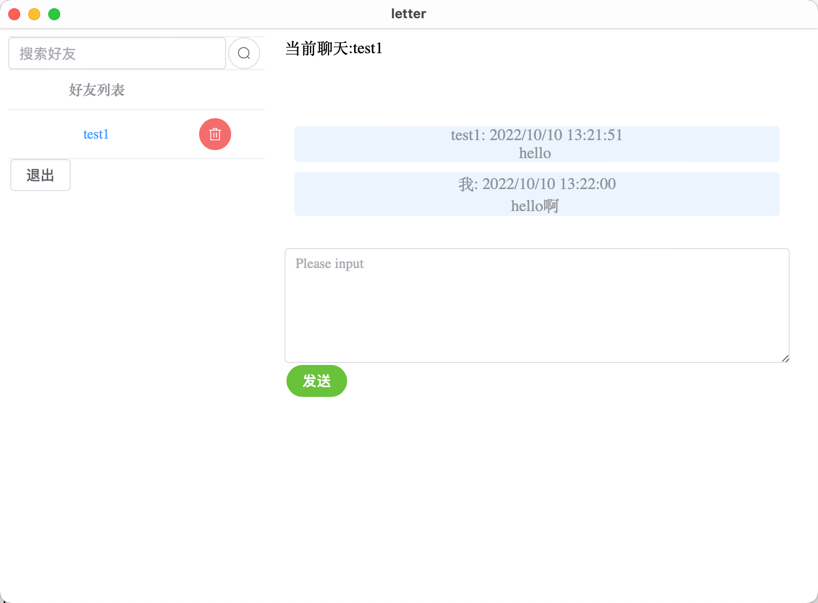
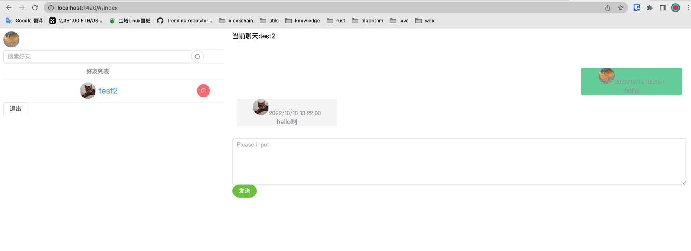

# letter

```text
 __       _______ .___________.___________. _______ .______      
|  |     |   ____||           |           ||   ____||   _  \     
|  |     |  |__   `---|  |----`---|  |----`|  |__   |  |_)  |    
|  |     |   __|      |  |        |  |     |   __|  |      /     
|  `----.|  |____     |  |        |  |     |  |____ |  |\  \----.
|_______||_______|    |__|        |__|     |_______|| _| `._____|
                                                                 
```

go + tauri + vue.js 做的一款通信软件,基于websocket实现即时聊天

## 背景

摸鱼时看到了[tauri](https://github.com/tauri-apps/tauri)
这个项目，可以直接通过前端代码构建app，于是想自己做个app，刚好又刷到了[go-chat](https://github.com/kone-net/go-chat)
这个项目，就想仿照着做个简单点的app，再把日常go开发所需的工具都加进来，以后用到时可以作为参考。

## 目前功能

* 登录/注册
* 搜索/添加/删除好友
* 单聊/聊天历史

## 后端技术

* web框架gin
* token鉴权jwt
* 配置工具viper
* 通信协议protobuf
* websocket
* 日志工具zap
* db工具gorm

## 运行方式

1. [执行sql](shell/generate.sql)
2. [修改对应配置](config/config.toml)
3. 运行

```shell
go build && ./letter
```

## 前端代码

[https://github.com/aisuosuo/letter-web](https://github.com/aisuosuo/letter-web)

### 运行

如果运行失败，请安装最新版的nodejs

```shell
git clone git@github.com:aisuosuo/letter-web.git
cd letter-web

## 网页版
npm run dev

## app版
#dev
npm run "tauri dev" / cargo tauri dev
#release
npm run "tauri build" / cargo tauri build [#可选参数：--debug]

```

### 运行app版需要安装rust以及tauri-cli

* [安装rust](https://www.rust-lang.org/zh-CN/tools/install)
    ```shell
  #macOS
  curl --proto '=https' --tlsv1.2 -sSf https://sh.rustup.rs | sh
  ```
* 安装tauri-cli :
    ```shell
    cargo install tauri-cli
    ```

## 截图

本身从没做过前端，所以界面略丑～～

### app



### web

